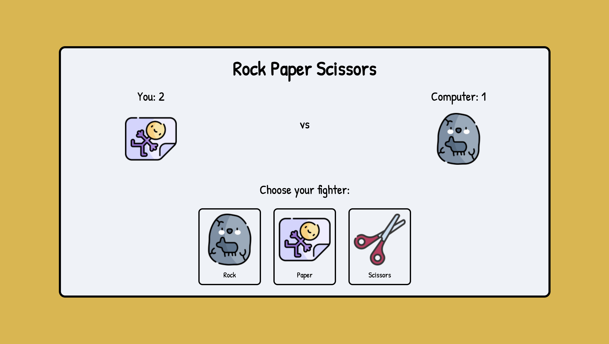

# Rock Paper Scissors (with UI)
This is an interactive version of Rock Paper Scissors that I made while going through
The Odin Project's Foundation course. The user plays the game against the computer.

Play the game here: https://ninavsworld.github.io/rock-paper-scissors/

## How It's Made
**Tech used:** HTML, CSS, Javascript

I created the UI using HTML and vanilla CSS, utilising flexbox to position the UI elements. Vanilla Javascript was used to write the logic for the core game loop. DOM manipulation was also done via Javascript to display the player's and computer's choices, scores and to display the start and end screens.

## Lessons Learned
A fundamental I learned was that you should not wrap event listeners in loops, as it is a sure
way to create bugs. This made me re-evaluate my assumptions/plan on how to code parts of my logic. Additionally, I thought that to make start and end screens, I had to link to separate HTML files but I discovered a neat trick to just toggle on and off div layers. Not as profound as the event listener revelation but cool, nonetheless.
